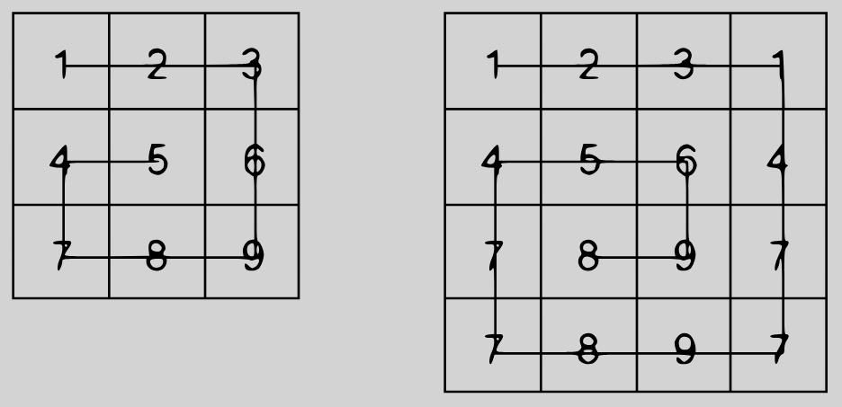

## Table of Contents
* [Description](#description )
* [Solution 1 (passed the tests)](#solution-1)
* [Solution 2](#solution-2)

## Description
source link: [Snail Sort](https://www.codewars.com/kata/521c2db8ddc89b9b7a0000c1)
Given an `n x n` array, return the array elements arranged from outermost elements to the middle element, traveling clockwise.
```
array = [[1,2,3],
         [4,5,6],
         [7,8,9]]
snail(array) #=> [1,2,3,6,9,8,7,4,5]
```
For better understanding, please follow the numbers of the next array consecutively:
```
array = [[1,2,3],
         [8,9,4],
         [7,6,5]]
snail(array) #=> [1,2,3,4,5,6,7,8,9]
```
This image will illustrate things more clearly:




NOTE: The idea is not sort the elements from the lowest value to the highest; the idea is to traverse the 2-d array in a clockwise snailshell pattern.

NOTE 2: The 0x0 (empty matrix) is represented as en empty array inside an array  `[[]]`.


## Solution 1
File: [SnailSuccess.cpp](SnailSuccess.cpp)

First, let's write the code to perform the special case (when the function gets an empty matrix). According to **NOTE 2**, an empty matrix is `[[]]`, i.e. an array containing one empty array. Thus, to check if the input matrix is empty, we need to check if the first element of `snail_map` has size 0. As a result, we get this code `if (snail_map[0].empty())return {};`. We can see from the test that if the function gets an empty matrix, it must return an empty array.

Now let's write an algorithm that will return the elements of the array from the outermost elements to the middle element, moving clockwise. First, let's declare a few variables: `d_row` and `d_col`, these are the directions of our movement (you can see the values of the directions in the comments in the code); `n` - the height and width of the matrix; `curr` - the value of the cell where we are standing now; `row` and `col` - row and column indices (in the range from 0 to n - 1).


Movement through the matrix will start from the cell with `row = 0` and `col = -1` (this is the cell to the left of the first cell). Before moving to the next cell, the algorithm will check if the idexes of this cell are in the range (code: `(row+d_row) >= 0 && (row + d_row) < n && (row + d_row) < n && (col+d_col) >= 0 && (col+d_col) < n`) and if this cell has not been visited before `curr < snail_map[row + d_row][col + d_col]`. If all clauses are true, the algorithm move to the next cell and write its value into the result array, and at `curr`, otherwise (meaning we have reached the end of the matrix or the next cell has been visited previously), we change direction. Then we repeat this until `curr` is not equal to `n * n`.

Since we will always have n * n elements in the input matrix, and the last element will have the value n<sup>2</sup>. Thus, to know if we have read all the cells of the matrix, we will compare `curr` with the value of the last element in this matrix, and the loop will end only after reaching and reading the value of the last cell.

Code:
```
    if (snail_map[0].empty())return {};

    std::vector<int> result;
    int d_row = 0; // 1 down, 0 stand, -1 up
    int d_col = 1; // -1 right, 0 stand, 1 left
    int n = snail_map.size();
    int curr = 0;

    // start position
    int row = 0;
    int col = -1;

    while (curr != n * n)
    {
        if ((row+d_row) >= 0 && (row + d_row) < n && (col+d_col) >= 0 && (col+d_col) < n && curr < snail_map[row + d_row][col + d_col])
        {
            result.push_back(snail_map[row + d_row][col + d_col]);
            curr = snail_map[row + d_row][col + d_col];

            // move to next cell
            row += d_row;
            col += d_col;
        }
        else
        {
            // the next cell doesn't exitst
            // so we change the direction
            if (d_row == 0 && d_col == 1)
            {
                // go down
                d_row = 1;
                d_col = 0;
            }
            else if (d_row == 1 && d_col == 0)
            {
                // go right
                d_row = 0;
                d_col = -1;
            }
            else if (d_row == 0 && d_col == -1)
            {
                // go up
                d_row = -1;
                d_col = 0;
            }
            else // else if (d_row == -1 && d_col == 0)
            {
                // go left
                d_row = 0;
                d_col = 1;
            }
        }
    }
    return result;
```

## Solution 2
File: SnailExecutionTimeOut.cpp


